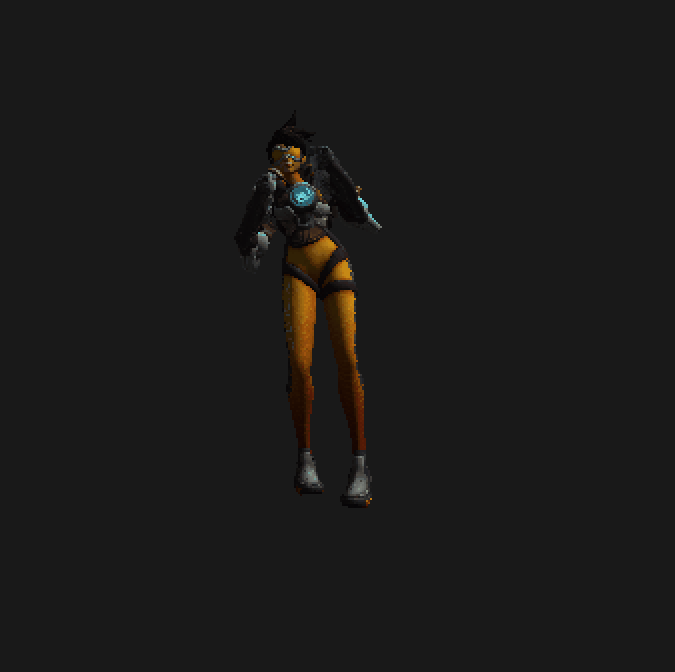

# Karazero(a word play for "from scratch")

This is a software renderer created from scratch(apart from using SDL for window events and ASSIMP for importing the models and animations).

## Demos

 

## Features
- Supports rigged models
- Comes with a very basic skeletal animation system
- Has support for multiple animations for a model
- Support for normal, metallic, emissive and diffuse mapping
- Clipping
- Barycentric interpolation of vertices
- Has a very intuitive and configurable Vertex and Fragment shader
- Some basic postprocessing effects are possible(bloom, blur, lightpass, mixing)